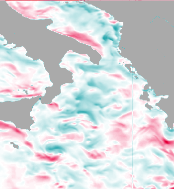
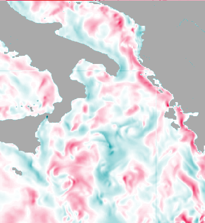
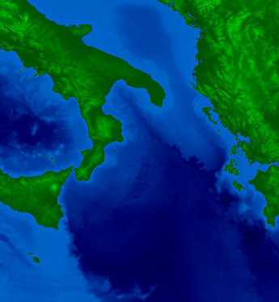
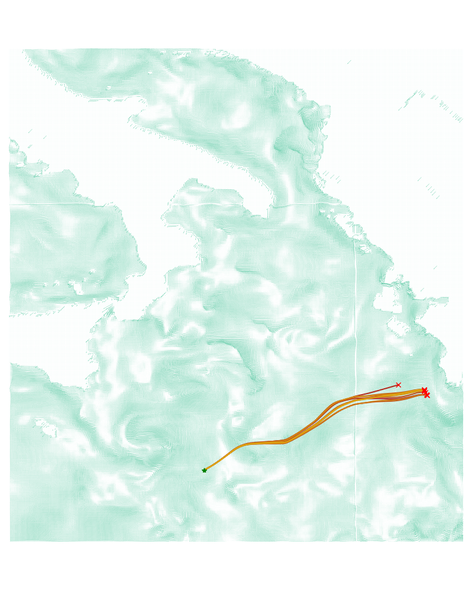

# Purpouse
This is a python project that was used in the 2024 COMAP Mathematical Modeling Compettition. The problem invovled predicting the path of malfunctioning submersibles in the Mediterranian sea.

# Estimating Undersea currents
An estimation of undersea currents was taken from surface data collected by a series of bouys. Although undersea currents are likely to differ from the surface currents (which are more succeptible to winds), both are to affected by general circulation trends including Thermohaline circulation. In order to account for this, the undersea currents were simulated as a probability distribution, which was constructed as a normal distribution centered aroudn the surface currents, with a high standard distribution. This means that teh general trends of the surface currents were represented, but exact values were considered to be more or less random. Images of surface currents taken from bouys are shown below:

# Topology
In order to accurately predict collision points of submsersibles, we also had to calculate the depth of the ocean at a given point. We used the General Bathymetric Chart of the Ocean (GEBCO). This is a dataset collected by lowering a series of Bathymetry probes onto the ocean floor, measuring the exact depth of the ocean at a series of points. The dataset is maintained by the Intergovernmental Hydro-graphic Commission. A topological map of this data is shown below:

# Simulating Submersible movements
The affects of currents on the submersible was calculated using a series of fluid dynamic equations, which can be found in full in the complete paper (attatched in this repo). A series of simulations were run, and visualized below:

Using thousands of these simulations, we computed a probability map of where the submersible is likely to be, and use this map in order to compute an optimal search route.
